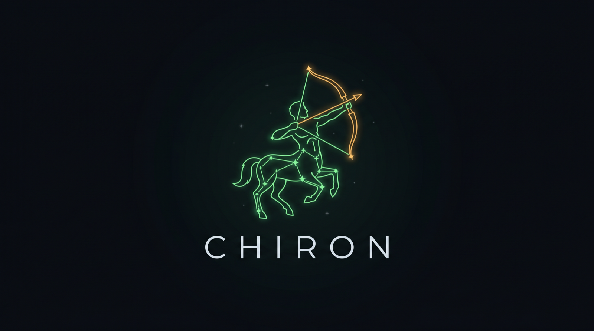

<p align="center">
  
</p>

<p align="center"><strong>An authored council of real thinkers for Claude Code. Seats, not generated personas.</strong></p>

<p align="center">
  
  
  
  
  
</p>

You make expensive, irreversible calls alone, and a single model just agrees with you. Studies now put AI sycophancy at roughly 50% more affirming than a human would be, which makes one agreeable chatbot a dangerous advisor for a decision you cannot take back. The usual fix, an "AI board of advisors," is worse: five voices of one model nodding along, or celebrity name-tags with nothing real behind them.

Chiron is different. Each **seat** is one mind, distilled from what that person actually published, cited per claim, and enforced by a linter. Seats carry **authored disagreements** drawn from the record, so a council surfaces real conflict instead of consensus theater. It is the board you cannot otherwise afford, and it will tell you what you do not want to hear.

## Install

Two ways in, depending on how much you want.

**Full experience — Claude Code plugin** (the orchestrator, live councils, benches, seat memory):

```
/plugin marketplace add rmarji/chiron
/plugin install chiron
```

Then run `/chiron:onboard`, or jump straight in:

```
/chiron:consult "take the retainer at 15k/mo or walk?"
/chiron:council relationship "we keep having the same fight about money"
```

**Just the seats — any agent.** Every seat is a standard Agent Skill, so the [`skills`](https://skills.sh) CLI drops the roster into 70+ harnesses (Claude Code, Cursor, Codex, Gemini CLI, Copilot, Cline, and more):

```bash
npx skills add rmarji/chiron                                   # choose seats interactively
npx skills add rmarji/chiron --all                            # install the whole roster
npx skills add rmarji/chiron -a cursor -s munger naval taleb  # one agent, chosen seats
```

Outside Claude Code you invoke a seat by talking to it ("what would the Munger corpus say about this?"); the slash commands and live councils are Claude Code-specific.

## See it work

A council does not average its seats into mush. It makes them argue from the record, then preserves the dissent. Here two seats hit an authored disagreement:

```
/chiron:council relationship "should I hold my frame or move toward my partner?"

▸ Deida (corpus)        confidence 4/5
  The corpus reads accommodation here as collapse. Attraction runs on
  polarity; a man who abandons his direction to soothe tension trades
  desire for peace. (The Way of the Superior Man, Parts 1-2, 1997)

▸ Terry Real (corpus)   confidence 4/5
  The RLT corpus reads frame-holding as the injury, not the cure. The
  stoic, self-sufficient posture is what breeds covert depression and
  dead marriages; the move is repair, not dominance. (Us, 2022; I Don't
  Want to Talk About It, 1997)

▸ Authored disagreement on record
  Deida vs Terry Real: is the distant, purpose-anchored man the problem,
  or the abdicating, directionless one? These two disagree at the level
  of diagnosis. Both positions cited above.

▸ Synthesis (neutral chair)
  Recommendation: name which failure is actually yours before you act.
  Dissent preserved, not averaged. What would change it: whether your
  pattern is avoidance (Real is right) or appeasement (Deida is right).
```

No other tool in this category ships that: sourced positions, a conflict pulled from what the authors really argued, and a synthesis that refuses to split the difference.

The rendered demo lives at [`demo/council-demo.mp4`](demo/council-demo.mp4) (a 23-second terminal recording of exactly this council). It is the single most differentiated asset in this category, since every competitor ships static screenshots.

## The roster

Fifteen seats ship in the box: fourteen corpus-mode (built from published work, cited, third person, no impersonation) and Rayo, an original-mode operating system.

| Seat | Pressure-tests | Built from (cited) |
|---|---|---|
| **Munger Lens** | inversion, incentives, avoiding stupidity | Poor Charlie's Almanack; The Psychology of Human Misjudgment |
| **Rumelt** (corpus) | strategy: diagnosis before action | Good Strategy Bad Strategy; The Crux |
| **Thiel** (corpus) | contrarian strategy, monopoly | Zero to One; CS183 lecture notes |
| **Paul Graham** (corpus) | startups, founders, growth | paulgraham.com essays; Hackers & Painters |
| **Hormozi** (corpus) | offers, pricing, sales | $100M Offers; $100M Leads |
| **Voss** (corpus) | negotiation, tactical empathy | Never Split the Difference |
| **Cialdini** (corpus) | persuasion, influence | Influence; Pre-Suasion |
| **Naval** (corpus) | leverage, judgment, wealth | The Almanack of Naval Ravikant; How to Get Rich |
| **Taleb** (corpus) | risk, antifragility, uncertainty | The Black Swan; Antifragile; Skin in the Game |
| **Kahneman** (corpus) | decisions, cognitive bias | Thinking, Fast and Slow; Noise |
| **Attia** (corpus) | longevity, health, performance | Outlive; The Drive |
| **Deida** (corpus) | polarity, purpose, relationships | The Way of the Superior Man |
| **Terry Real** (corpus) | relational repair, conflict | Us; The New Rules of Marriage |
| **Marcus Aurelius** (corpus) | stoic temperament, adversity | Meditations |
| **Rayo OS** (original) | execution, shipping, decision-routing | FATE, Ship Gate, MAX THREE (authored) |

Every real-person seat carries 6,000 to 10,000 words of source-attributed reference material and passes the linter. The "Built from" column is the thing no competitor has: each claim traces to a page, a talk, or an episode. Add your own with `/chiron:distill`, and put yourself in the room with `/chiron:distill-me`.

## Why Chiron, not a stock council

The AI-council space is crowded and almost all of it fails the same three ways. Chiron is built as the answer to each.

- **Authored, not generated.** The persona wave auto-generates a "mind" from any input in a weekend. Chiron seats are hand-authored and curated. Quality and trust over quantity and speed.
- **Cited, not vibes.** Every substantive claim points at a source, and `scripts/lint_seat.py` fails the build on seats that skimp on provenance. The lint is the standard, not a suggestion.
- **Real disagreement, not manufactured.** Competitors fake conflict by assigning opposing archetypes ("you be the contrarian"). Chiron surfaces only conflicts that are authored from what the people actually argued, with both positions cited. If none exist for a topic, the council says so rather than inventing one.
- **Memory.** Seats keep a private log. They remember what they told you and whether you listened.
- **It routes itself.** `/chiron:consult` reads your decision and picks the right expert, or convenes the right few, or tells you it is not worth a council at all. No hunting through a roster, no summoning a debate for a call you could make in your sleep.

## Commands

| Command | Does |
|---|---|
| `/chiron:onboard` | First-run setup: meet the roster, distill yourself, get starter benches |
| `/chiron:consult <q>` | **Auto-routes.** Chiron picks the right expert(s), and decides whether a council is even worth convening |
| `/chiron:ask <seat> <q>` | One authored lens, cited, with its memory of your past calls |
| `/chiron:council <bench> <q>` | Independent takes gathered in isolation, real disagreements surfaced, one synthesis with dissent preserved |
| `/chiron:bench` | Create and edit benches (your curated line-ups) as plain YAML |
| `/chiron:roster` | See who is available, filter by domain |
| `/chiron:distill <desc>` | Distill a new seat: deep research on the subject's corpus, full cited seat, linted |
| `/chiron:distill-me` | Distill **you** into a private seat, and read out your go-to experts |
| `/chiron:lint` | Validate seats against the SEAT_SPEC standard |
| `/chiron:log <seat>` | Review past consults and the decisions you never closed |

You can also just talk to it: "run this by my product bench," "what would Munger say about this."

## Make it yours

`/chiron:onboard` gets you from install to your first real council in a few minutes. It shows the roster, then offers `/chiron:distill-me`, which distills *you* the way the roster distills its thinkers: it reads what you point it at (your notes, your instruction files, this conversation), interviews you, and writes a private, original-mode `me` seat holding your mission, values, goals, frameworks, and the experts you already reach for. That `me` seat can chair your councils and be argued with, and its read-out of your go-to experts becomes a recommended roster.

Your `me` seat is **private**: it lives in `~/.claude/chiron/seats/` (or a project's `.chiron/seats/`), never in this repo, never committed, never shipped. Your own seats and the bundled roster merge automatically (project shadows global shadows bundled), so a seat you distill is available everywhere you use Chiron.

## Anatomy of a seat

```
skills/seats/munger/
├── SKILL.md              # the mind: priors, heuristics, refusals, voice (< 6k tokens)
├── disagreements.md     # authored conflicts with other seats, positions cited
├── references/          # the depth: complete extraction of the published thinking
│   ├── principles.md    ├── mental-models.md   ├── frameworks.md
│   ├── anti-patterns.md ├── heuristics.md      ├── quotes.md
│   └── sources.md
└── log.md               # append-only consult memory (gitignored)
```

Everything is files. No database, no server, no API keys. The full standard and depth bar live in [SEAT_SPEC.md](SEAT_SPEC.md).

## Portability

A seat is a real, drop-in Agent Skill. It follows the [Agent Skills](https://agentskills.io) open standard (standard `name`/`description` frontmatter), with Chiron's extras (`x-chiron:`, `disagreements.md`, `references/`) that other harnesses harmlessly ignore. Beyond the `npx skills` installer above, you can copy one by hand into any agent's skills directory:

```bash
# Claude Code          Cursor                Codex CLI            Gemini CLI / generic
~/.claude/skills/      ~/.cursor/skills/     ~/.codex/skills/     ~/.agents/skills/

cp -r skills/seats/munger ~/.claude/skills/munger
```

The slash commands, orchestrator, and live councils are Claude Code-specific; the seats themselves run anywhere.

## The standard is the point

`scripts/lint_seat.py` is stdlib-only Python and runs identically in CI, so the seat standard is enforceable by anyone, not just inside Claude.

```bash
python3 scripts/lint_seat.py --all                  # exit 0 pass / 1 warns / 2 errors
python3 scripts/lint_seat.py skills/seats/munger --explain
python3 scripts/registry.py --json                  # roster index
```

It hard-fails first-person impersonation of anyone living (rule L1), missing citations (L4), and shallow reference sets (L12). That is what makes a seat a seat and not a name.

## Benches

Global: `~/.claude/chiron/benches.yaml`. Project: `.chiron/benches.yaml` (project shadows global on name collision). Plain YAML you can edit by hand.

```yaml
benches:
  money:
    seats: [munger, naval, rayo]
    chairman: neutral          # or a seat id
    default_depth: quick       # quick | full
```

## On corpus-mode and provenance

Real-person seats speak in the third person about the corpus ("the Munger corpus would flag...") and cite a source per claim. No first-person cosplay of anyone living; the linter hard-fails it. This is not only legal hygiene, it is why sourced heuristics beat generated vibes. Every real-person seat is an independent study aid based on published works, not affiliated with or endorsed by its subject. See [LEGAL.md](LEGAL.md) for the provenance policy and takedown protocol.

## License

MIT. Frameworks and ideas are paraphrased and cited from published works (ideas are not copyrightable; expression is, so quotes are short attributed excerpts). See [LEGAL.md](LEGAL.md).
